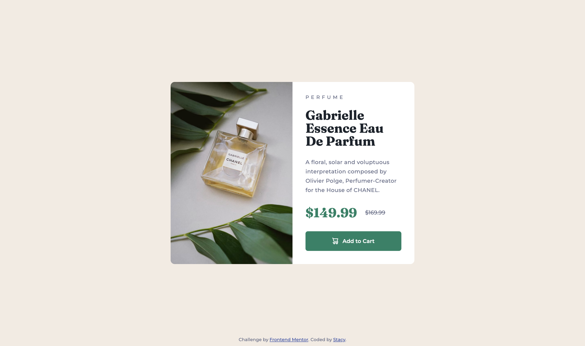

# Frontend Mentor - Product preview card component solution

This is a solution to the [Product preview card component challenge on Frontend Mentor](https://www.frontendmentor.io/challenges/product-preview-card-component-GO7UmttRfa). Frontend Mentor challenges help you improve your coding skills by building realistic projects.

### The challenge

Users should be able to:

- View the optimal layout depending on their device's screen size
- See hover and focus states for interactive elements

### Screenshot

### Links

- Live Site URL: [Add live site URL here](https://your-live-site-url.com)

### Built with

- Semantic HTML5 markup
- Flexbox
- CSS Grid
- [React](https://reactjs.org/) - JS library

### What I learned

This challenge only serves as an exercise to practice React. Along the way, I learned the use of picture element to group different source versions of the same image. A method that is used for responsive images. You put the default image in the source tag and the mobile version in the img tag.

## Author

- Frontend Mentor - [@stautuan](https://www.frontendmentor.io/profile/stautuan)
